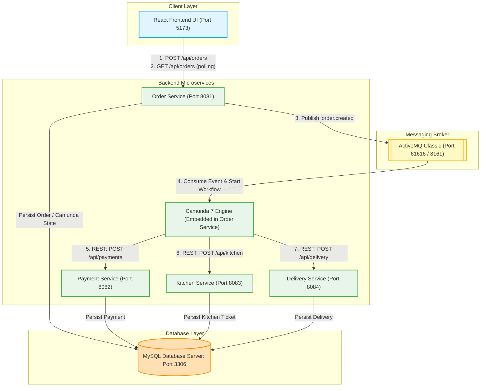
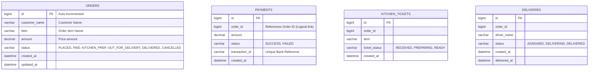
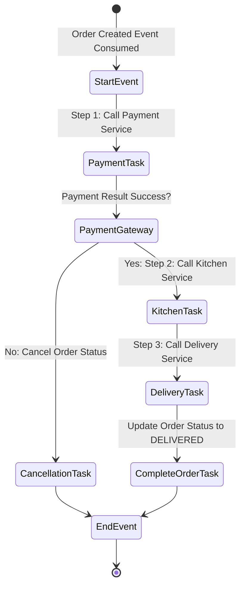

# Architecture & Project Structure: Online Food Order Processing System

This document outlines the architecture, Maven project structure, database design, REST APIs, Camunda BPMN workflow, ActiveMQ flows, React frontend components, and the development roadmap for the Online Food Order Processing System.

---

## 1. Complete Architecture

The system follows a **Microservices Architecture** with a decoupled, asynchronous processing flow. The React Frontend communicates with the **Order Service** via REST APIs. Real-time updates are driven by a polling mechanism from the frontend to the Order Service. 

Below is the high-level architecture diagram showing the system components, communication channels, and data flow.



### Architectural Key Decisions:
- **Embedded Camunda Engine**: The Camunda 7 Engine is embedded in the `order-service` to centralize orchestration logic, process history, and state transitions, avoiding the overhead of maintaining a standalone Camunda server.
- **Asynchronous Order Creation**: Placing an order publishes a message to ActiveMQ and immediately returns a `201 Created` status with the Order ID. This guarantees responsive UI behavior during load spikes.
- **Microservice Autonomy**: The Payment, Kitchen, and Delivery services operate on separate ports, maintain their own database schemas (isolated via logical schemas or distinct tables within the MySQL instance), and expose specific REST endpoints called by Camunda's HTTP Connector/Service Task workers.
- **Resilience and Error Handling**: The Camunda workflow includes an exclusive gateway following payment processing. If a payment failure occurs, the engine triggers an automated roll-back/cancellation state, updates the order status, and stops execution.

---

## 2. Maven Multi-Module Structure

To manage multiple microservices cleanly, we use a single Maven Multi-Module repository. This configuration maintains a root project containing the shared configuration, dependency versions, and individual modules for each service.

```text
food-ordering-system/               # Root Project Directory
├── pom.xml                         # Parent pom.xml
├── docker-compose.yml              # Infrastructure Orchestration (MySQL, ActiveMQ)
├── order-service/                  # Module 1: Order Service (Orchestrator & REST Entry)
│   ├── pom.xml
│   └── src/main/java/com/foodsystem/order/...
├── payment-service/                # Module 2: Payment Service
│   ├── pom.xml
│   └── src/main/java/com/foodsystem/payment/...
├── kitchen-service/                # Module 3: Kitchen Service
│   ├── pom.xml
│   └── src/main/java/com/foodsystem/kitchen/...
├── delivery-service/               # Module 4: Delivery Service
│   ├── pom.xml
│   └── src/main/java/com/foodsystem/delivery/...
└── frontend/                       # React, Vite, TypeScript SPA
    ├── package.json
    └── tsconfig.json
```

---

## 3. Parent `pom.xml` Plan

The parent `pom.xml` defines dependency management, plugins, properties, and module structures. We enforce **Java 21** and **Spring Boot 3.5.0-M1** (or `3.4.x` / `3.5.0-SNAPSHOT` as available; we'll target `3.5.0` dependencies).

```xml
<?xml version="1.0" encoding="UTF-8"?>
<project xmlns="http://maven.apache.org/POM/4.0.0"
         xmlns:xsi="http://www.w3.org/2001/XMLSchema-instance"
         xsi:schemaLocation="http://maven.apache.org/POM/4.0.0 http://maven.apache.org/xsd/maven-4.0.0.xsd">
    <modelVersion>4.0.0</modelVersion>

    <groupId>com.foodsystem</groupId>
    <artifactId>food-ordering-system</artifactId>
    <version>1.0.0-SNAPSHOT</version>
    <packaging>pom</packaging>

    <name>Food Ordering System - Parent</name>
    <description>Parent POM for Online Food Order Processing System</description>

    <properties>
        <java.version>21</java.version>
        <maven.compiler.source>${java.version}</maven.compiler.source>
        <maven.compiler.target>${java.version}</maven.compiler.target>
        <project.build.sourceEncoding>UTF-8</project.build.sourceEncoding>
        
        <!-- Versions -->
        <spring-boot.version>3.5.0</spring-boot.version>
        <camunda.spring-boot.version>7.21.0</camunda.spring-boot.version>
        <mysql-connector.version>9.0.0</mysql-connector.version>
        <flyway.version>10.15.0</flyway.version>
        <mapstruct.version>1.6.0.RC1</mapstruct.version>
        <lombok.version>1.18.32</lombok.version>
        <lombok-mapstruct-binding.version>0.2.0</lombok-mapstruct-binding.version>
        <springdoc.version>2.8.5</springdoc.version>
    </properties>

    <modules>
        <module>order-service</module>
        <module>payment-service</module>
        <module>kitchen-service</module>
        <module>delivery-service</module>
    </modules>

    <dependencyManagement>
        <dependencies>
            <!-- Spring Boot BOM -->
            <dependency>
                <groupId>org.springframework.boot</groupId>
                <artifactId>spring-boot-dependencies</artifactId>
                <version>${spring-boot.version}</version>
                <type>pom</type>
                <scope>import</scope>
            </dependency>

            <!-- Camunda BOM -->
            <dependency>
                <groupId>org.camunda.bpm</groupId>
                <artifactId>camunda-bom</artifactId>
                <version>${camunda.spring-boot.version}</version>
                <scope>import</scope>
                <type>pom</type>
            </dependency>
            
            <!-- OpenAPI/Swagger -->
            <dependency>
                <groupId>org.springdoc</groupId>
                <artifactId>springdoc-openapi-starter-webmvc-ui</artifactId>
                <version>${springdoc.version}</version>
            </dependency>

            <!-- MapStruct -->
            <dependency>
                <groupId>org.mapstruct</groupId>
                <artifactId>mapstruct</artifactId>
                <version>${mapstruct.version}</version>
            </dependency>
        </dependencies>
    </dependencyManagement>

    <build>
        <pluginManagement>
            <plugins>
                <plugin>
                    <groupId>org.springframework.boot</groupId>
                    <artifactId>spring-boot-maven-plugin</artifactId>
                    <version>${spring-boot.version}</version>
                    <executions>
                        <execution>
                            <goals>
                                <goal>repackage</goal>
                            </goals>
                        </execution>
                    </executions>
                    <configuration>
                        <excludes>
                            <exclude>
                                <groupId>org.projectlombok</groupId>
                                <artifactId>lombok</artifactId>
                            </exclude>
                        </excludes>
                    </configuration>
                </plugin>

                <plugin>
                    <groupId>org.apache.maven.plugins</groupId>
                    <artifactId>maven-compiler-plugin</artifactId>
                    <version>3.13.0</version>
                    <configuration>
                        <source>${java.version}</source>
                        <target>${java.version}</target>
                        <annotationProcessorPaths>
                            <path>
                                <groupId>org.projectlombok</groupId>
                                <artifactId>lombok</artifactId>
                                <version>${lombok.version}</version>
                            </path>
                            <path>
                                <groupId>org.mapstruct</groupId>
                                <artifactId>mapstruct-processor</artifactId>
                                <version>${mapstruct.version}</version>
                            </path>
                            <path>
                                <groupId>org.projectlombok</groupId>
                                <artifactId>lombok-mapstruct-binding</artifactId>
                                <version>${lombok-mapstruct-binding.version}</version>
                            </path>
                        </annotationProcessorPaths>
                    </configuration>
                </plugin>
            </plugins>
        </pluginManagement>
    </build>
</project>
```

---

## 4. Child Module Structure

Every service employs a clean architecture layout. Below is the details of directory layout, package paths, and specific `pom.xml` dependencies for each service.

### 4.1 Order Service (`order-service`)
- **Port**: `8081`
- **Key Responsibilities**: HTTP Entry, DB Storage for Orders, ActiveMQ Message Producer & Consumer, Embedded Camunda 7 Workflow Orchestrator.
- **Key Dependencies**: Spring Web, Spring Data JPA, Camunda Starter (webapp + engine), ActiveMQ JMS, MySQL, Flyway, Spring Validation, Lombok, MapStruct.

#### pom.xml
```xml
<?xml version="1.0" encoding="UTF-8"?>
<project xmlns="http://maven.apache.org/POM/4.0.0"
         xmlns:xsi="http://www.w3.org/2001/XMLSchema-instance"
         xsi:schemaLocation="http://maven.apache.org/POM/4.0.0 http://maven.apache.org/xsd/maven-4.0.0.xsd">
    <modelVersion>4.0.0</modelVersion>
    
    <parent>
        <groupId>com.foodsystem</groupId>
        <artifactId>food-ordering-system</artifactId>
        <version>1.0.0-SNAPSHOT</version>
    </parent>

    <artifactId>order-service</artifactId>

    <dependencies>
        <dependency>
            <groupId>org.springframework.boot</groupId>
            <artifactId>spring-boot-starter-web</artifactId>
        </dependency>
        <dependency>
            <groupId>org.springframework.boot</groupId>
            <artifactId>spring-boot-starter-data-jpa</artifactId>
        </dependency>
        <dependency>
            <groupId>org.springframework.boot</groupId>
            <artifactId>spring-boot-starter-activemq</artifactId>
        </dependency>
        <dependency>
            <groupId>org.springframework.boot</groupId>
            <artifactId>spring-boot-starter-validation</artifactId>
        </dependency>
        <dependency>
            <groupId>org.springframework.boot</groupId>
            <artifactId>spring-boot-starter-actuator</artifactId>
        </dependency>

        <!-- Camunda Embedded -->
        <dependency>
            <groupId>org.camunda.bpm.springboot</groupId>
            <artifactId>camunda-bpm-spring-boot-starter-rest</artifactId>
        </dependency>
        <dependency>
            <groupId>org.camunda.bpm.springboot</groupId>
            <artifactId>camunda-bpm-spring-boot-starter-webapp</artifactId>
        </dependency>
        
        <!-- MySQL & Migration -->
        <dependency>
            <groupId>com.mysql</groupId>
            <artifactId>mysql-connector-j</artifactId>
            <scope>runtime</scope>
        </dependency>
        <dependency>
            <groupId>org.flywaydb</groupId>
            <artifactId>flyway-core</artifactId>
        </dependency>
        <dependency>
            <groupId>org.flywaydb</groupId>
            <artifactId>flyway-mysql</artifactId>
        </dependency>

        <!-- Swagger & Helpers -->
        <dependency>
            <groupId>org.springdoc</groupId>
            <artifactId>springdoc-openapi-starter-webmvc-ui</artifactId>
        </dependency>
        <dependency>
            <groupId>org.projectlombok</groupId>
            <artifactId>lombok</artifactId>
            <scope>provided</scope>
        </dependency>
        <dependency>
            <groupId>org.mapstruct</groupId>
            <artifactId>mapstruct</artifactId>
        </dependency>

        <!-- Test -->
        <dependency>
            <groupId>org.springframework.boot</groupId>
            <artifactId>spring-boot-starter-test</artifactId>
            <scope>test</scope>
        </dependency>
    </dependencies>

    <build>
        <plugins>
            <plugin>
                <groupId>org.springframework.boot</groupId>
                <artifactId>spring-boot-maven-plugin</artifactId>
            </plugin>
        </plugins>
    </build>
</project>
```

#### Package Structure
```text
order-service/src/main/
├── java/com/foodsystem/order/
│   ├── OrderServiceApplication.java
│   ├── config/
│   │   ├── ActiveMQConfig.java
│   │   ├── CamundaConfig.java
│   │   └── SwaggerConfig.java
│   ├── controller/
│   │   └── OrderController.java
│   ├── entity/
│   │   └── Order.java
│   ├── repository/
│   │   └── OrderRepository.java
│   ├── service/
│   │   ├── OrderService.java
│   │   └── WorkflowService.java
│   ├── dto/
│   │   ├── OrderCreateRequest.java
│   │   └── OrderResponse.java
│   ├── mapper/
│   │   └── OrderMapper.java
│   ├── messaging/
│   │   ├── OrderEventPublisher.java
│   │   └── OrderEventConsumer.java
│   └── workflow/
│       ├── delegate/
│       │   ├── CallPaymentDelegate.java
│       │   ├── CallKitchenDelegate.java
│       │   ├── CallDeliveryDelegate.java
│       │   └── CompleteWorkflowDelegate.java
│       └── listener/
│           └── OrderWorkflowListener.java
└── resources/
    ├── application.yml
    ├── db/migration/
    │   └── V1__create_orders_table.sql
    └── bpmn/
        └── order-process.bpmn
```

---

### 4.2 Payment Service (`payment-service`)
- **Port**: `8082`
- **Responsibilities**: Process REST-based payment invocations from Camunda delegate, mock failure ratios, log outcomes, save records.

#### pom.xml
```xml
<?xml version="1.0" encoding="UTF-8"?>
<project xmlns="http://maven.apache.org/POM/4.0.0"
         xmlns:xsi="http://www.w3.org/2001/XMLSchema-instance"
         xsi:schemaLocation="http://maven.apache.org/POM/4.0.0 http://maven.apache.org/xsd/maven-4.0.0.xsd">
    <modelVersion>4.0.0</modelVersion>
    
    <parent>
        <groupId>com.foodsystem</groupId>
        <artifactId>food-ordering-system</artifactId>
        <version>1.0.0-SNAPSHOT</version>
    </parent>

    <artifactId>payment-service</artifactId>

    <dependencies>
        <dependency>
            <groupId>org.springframework.boot</groupId>
            <artifactId>spring-boot-starter-web</artifactId>
        </dependency>
        <dependency>
            <groupId>org.springframework.boot</groupId>
            <artifactId>spring-boot-starter-data-jpa</artifactId>
        </dependency>
        <dependency>
            <groupId>org.springframework.boot</groupId>
            <artifactId>spring-boot-starter-validation</artifactId>
        </dependency>
        <dependency>
            <groupId>org.springframework.boot</groupId>
            <artifactId>spring-boot-starter-actuator</artifactId>
        </dependency>
        <dependency>
            <groupId>com.mysql</groupId>
            <artifactId>mysql-connector-j</artifactId>
            <scope>runtime</scope>
        </dependency>
        <dependency>
            <groupId>org.flywaydb</groupId>
            <artifactId>flyway-core</artifactId>
        </dependency>
        <dependency>
            <groupId>org.flywaydb</groupId>
            <artifactId>flyway-mysql</artifactId>
        </dependency>
        <dependency>
            <groupId>org.springdoc</groupId>
            <artifactId>springdoc-openapi-starter-webmvc-ui</artifactId>
        </dependency>
        <dependency>
            <groupId>org.projectlombok</groupId>
            <artifactId>lombok</artifactId>
            <scope>provided</scope>
        </dependency>
        <dependency>
            <groupId>org.mapstruct</groupId>
            <artifactId>mapstruct</artifactId>
        </dependency>
        <dependency>
            <groupId>org.springframework.boot</groupId>
            <artifactId>spring-boot-starter-test</artifactId>
            <scope>test</scope>
        </dependency>
    </dependencies>

    <build>
        <plugins>
            <plugin>
                <groupId>org.springframework.boot</groupId>
                <artifactId>spring-boot-maven-plugin</artifactId>
            </plugin>
        </plugins>
    </build>
</project>
```

#### Package Structure
```text
payment-service/src/main/
├── java/com/foodsystem/payment/
│   ├── PaymentServiceApplication.java
│   ├── controller/
│   │   └── PaymentController.java
│   ├── entity/
│   │   └── Payment.java
│   ├── repository/
│   │   └── PaymentRepository.java
│   ├── service/
│   │   └── PaymentService.java
│   └── dto/
│       ├── PaymentRequest.java
│       └── PaymentResponse.java
└── resources/
    ├── application.yml
    └── db/migration/
        └── V1__create_payments_table.sql
```

---

### 4.3 Kitchen Service (`kitchen-service`)
- **Port**: `8083`
- **Responsibilities**: Process food tickets, log operations, save tickets in the database.

#### pom.xml
Similar to `payment-service` with artifactId `kitchen-service`.

#### Package Structure
```text
kitchen-service/src/main/
├── java/com/foodsystem/kitchen/
│   ├── KitchenServiceApplication.java
│   ├── controller/
│   │   └── KitchenController.java
│   ├── entity/
│   │   └── KitchenTicket.java
│   ├── repository/
│   │   └── KitchenRepository.java
│   ├── service/
│   │   └── KitchenService.java
│   └── dto/
│       ├── KitchenRequest.java
│       └── KitchenResponse.java
└── resources/
    ├── application.yml
    └── db/migration/
        └── V1__create_kitchen_tickets_table.sql
```

---

### 4.4 Delivery Service (`delivery-service`)
- **Port**: `8084`
- **Responsibilities**: Driver assignments, status logs, database persistence for logistics records.

#### pom.xml
Similar to `payment-service` with artifactId `delivery-service`.

#### Package Structure
```text
delivery-service/src/main/
├── java/com/foodsystem/delivery/
│   ├── DeliveryServiceApplication.java
│   ├── controller/
│   │   └── DeliveryController.java
│   ├── entity/
│   │   └── Delivery.java
│   ├── repository/
│   │   └── DeliveryRepository.java
│   ├── service/
│   │   └── DeliveryService.java
│   └── dto/
│       ├── DeliveryRequest.java
│       └── DeliveryResponse.java
└── resources/
    ├── application.yml
    └── db/migration/
        └── V1__create_deliveries_table.sql
```

---

## 5. Database Design

Each service uses its own database context inside MySQL. Logical separation or physically distinct schemas will prevent inter-service coupling. 



### Database Migration Scripts (Flyway)

#### V1__create_orders_table.sql (`order-service`)
```sql
CREATE TABLE orders (
    id BIGINT AUTO_INCREMENT PRIMARY KEY,
    customer_name VARCHAR(100) NOT NULL,
    item VARCHAR(255) NOT NULL,
    amount DECIMAL(10, 2) NOT NULL,
    status VARCHAR(50) NOT NULL,
    created_at TIMESTAMP DEFAULT CURRENT_TIMESTAMP,
    updated_at TIMESTAMP DEFAULT CURRENT_TIMESTAMP ON UPDATE CURRENT_TIMESTAMP
);
```

#### V1__create_payments_table.sql (`payment-service`)
```sql
CREATE TABLE payments (
    id BIGINT AUTO_INCREMENT PRIMARY KEY,
    order_id BIGINT NOT NULL,
    amount DECIMAL(10, 2) NOT NULL,
    status VARCHAR(50) NOT NULL,
    transaction_id VARCHAR(100) NOT NULL UNIQUE,
    created_at TIMESTAMP DEFAULT CURRENT_TIMESTAMP
);
```

#### V1__create_kitchen_tickets_table.sql (`kitchen-service`)
```sql
CREATE TABLE kitchen_tickets (
    id BIGINT AUTO_INCREMENT PRIMARY KEY,
    order_id BIGINT NOT NULL,
    item VARCHAR(255) NOT NULL,
    ticket_status VARCHAR(50) NOT NULL,
    created_at TIMESTAMP DEFAULT CURRENT_TIMESTAMP
);
```

#### V1__create_deliveries_table.sql (`delivery-service`)
```sql
CREATE TABLE deliveries (
    id BIGINT AUTO_INCREMENT PRIMARY KEY,
    order_id BIGINT NOT NULL,
    driver_name VARCHAR(100) NOT NULL,
    status VARCHAR(50) NOT NULL,
    created_at TIMESTAMP DEFAULT CURRENT_TIMESTAMP,
    delivered_at TIMESTAMP NULL
);
```

---

## 6. REST API Design

Each endpoint is designed adhering to OpenAPI conventions.

### 6.1 Order Service API

#### **Create Order**
* **Endpoint**: `POST /api/orders`
* **Request Payload (`application/json`)**:
  ```json
  {
    "customerName": "Alice Vance",
    "item": "Double Truffle Burger",
    "amount": 24.50
  }
  ```
* **Response Payload (`201 Created`)**:
  ```json
  {
    "orderId": 123,
    "customerName": "Alice Vance",
    "item": "Double Truffle Burger",
    "amount": 24.50,
    "status": "PLACED",
    "createdAt": "2026-07-21T18:25:00Z"
  }
  ```

#### **Get All Orders**
* **Endpoint**: `GET /api/orders`
* **Response Payload (`200 OK`)**:
  ```json
  [
    {
      "orderId": 123,
      "customerName": "Alice Vance",
      "item": "Double Truffle Burger",
      "amount": 24.50,
      "status": "PAID",
      "createdAt": "2026-07-21T18:25:00Z"
    }
  ]
  ```

#### **Get Order By ID**
* **Endpoint**: `GET /api/orders/{id}`
* **Response Payload (`200 OK`)**:
  ```json
  {
    "orderId": 123,
    "customerName": "Alice Vance",
    "item": "Double Truffle Burger",
    "amount": 24.50,
    "status": "PAID",
    "createdAt": "2026-07-21T18:25:00Z",
    "updatedAt": "2026-07-21T18:25:35Z"
  }
  ```

### 6.2 Payment Service API

#### **Process Payment**
* **Endpoint**: `POST /api/payments`
* **Request Payload**:
  ```json
  {
    "orderId": 123,
    "amount": 24.50
  }
  ```
* **Response Payload (`200 OK` or `400 Bad Request`)**:
  ```json
  {
    "paymentId": 88,
    "orderId": 123,
    "amount": 24.50,
    "status": "SUCCESS",
    "transactionId": "TXN-9023812039",
    "timestamp": "2026-07-21T18:25:12Z"
  }
  ```

### 6.3 Kitchen Service API

#### **Create Ticket**
* **Endpoint**: `POST /api/kitchen`
* **Request Payload**:
  ```json
  {
    "orderId": 123,
    "item": "Double Truffle Burger"
  }
  ```
* **Response Payload (`200 OK`)**:
  ```json
  {
    "ticketId": 45,
    "orderId": 123,
    "item": "Double Truffle Burger",
    "status": "PREPARING",
    "timestamp": "2026-07-21T18:25:18Z"
  }
  ```

### 6.4 Delivery Service API

#### **Assign Driver**
* **Endpoint**: `POST /api/delivery`
* **Request Payload**:
  ```json
  {
    "orderId": 123
  }
  ```
* **Response Payload (`200 OK`)**:
  ```json
  {
    "deliveryId": 67,
    "orderId": 123,
    "driverName": "Flash Bolt (Mock)",
    "status": "ASSIGNED",
    "timestamp": "2026-07-21T18:25:40Z"
  }
  ```

---

## 7. Camunda BPMN Workflow

The Order Process BPMN workflow is embedded in the `order-service`. It handles orchestration using service tasks that interact with the payment, kitchen, and delivery microservices.



### Service Tasks Configuration

1. **Start Event**:
   - Initiator: `orderEventConsumer`
   - Business Key: `orderId`
   - Variables: `orderId`, `customerName`, `item`, `amount`

2. **Call Payment Service (Service Task)**:
   - Topic/Delegate: `${callPaymentDelegate}`
   - Action: REST call to `http://localhost:8082/api/payments`
   - Outputs: Sets process variable `paymentStatus` ("SUCCESS" or "FAILED")

3. **Payment Gateways (Exclusive Gateway)**:
   - Condition (Success): `${paymentStatus == 'SUCCESS'}`
   - Condition (Failed): `${paymentStatus != 'SUCCESS'}`

4. **Call Kitchen Service (Service Task)**:
   - Topic/Delegate: `${callKitchenDelegate}`
   - Action: REST call to `http://localhost:8083/api/kitchen`
   - Variables: `orderId`, `item`

5. **Call Delivery Service (Service Task)**:
   - Topic/Delegate: `${callDeliveryDelegate}`
   - Action: REST call to `http://localhost:8084/api/delivery`
   - Variables: `orderId`

6. **Complete Order Task (Service Task)**:
   - Topic/Delegate: `${completeWorkflowDelegate}`
   - Action: Local update to Order DB status = `DELIVERED`, Log `Workflow COMPLETE`

7. **Cancel Order Task (Service Task)**:
   - Topic/Delegate: `${completeWorkflowDelegate}` (passes cancellation status)
   - Action: Local update to Order DB status = `CANCELLED`, Log `Workflow CANCELLED`

---

## 8. ActiveMQ Flow

We use ActiveMQ to handle asynchronous processing at the entry point. The REST POST request creates a record and fires a lightweight JMS payload.

### Flow Path:
1. `OrderController` receives `POST /api/orders`.
2. `OrderService` saves order to DB in state `PLACED`.
3. `OrderEventPublisher` serializes payload into a JSON text message and calls `jmsTemplate.convertAndSend("order.created", payload)`.
4. `OrderEventConsumer` listens on queue `order.created`. Upon receipt, it parses the payload and uses Camunda's `RuntimeService.startProcessInstanceByKey("order-process", businessKey, variables)` to initiate the orchestrator workflow.

```text
+-------------------+      REST       +------------------+
|     React UI      | --------------> |  Order Service   |
+-------------------+                 +------------------+
                                                |
                                        Publish Event to Queue
                                                |
                                                v
                                      [Queue: order.created]
                                                |
                                          Consume Event
                                                |
                                                v
                                      +------------------+
                                      | Camunda Engine   |
                                      +------------------+
```

### Event Payload (`order.created` queue):
```json
{
  "orderId": 123,
  "customerName": "Alice Vance",
  "item": "Double Truffle Burger",
  "amount": 24.50
}
```

---

## 9. React Page Structure

The React frontend uses **Vite**, **TypeScript**, and **CSS Modules** for a premium aesthetic (dark-mode focus, glassmorphism card systems, and vibrant transition animations).

### File Hierarchy
```text
frontend/
├── index.html
├── package.json
├── vite.config.ts
├── src/
│   ├── main.tsx
│   ├── App.tsx
│   ├── index.css                   # Global CSS (Theme variables, Reset, Font imports)
│   ├── types.ts                    # TypeScript Interfaces (Order, OrderRequest)
│   ├── components/
│   │   ├── OrderForm.tsx           # Order placement component (glassmorphism card)
│   │   ├── OrderDashboard.tsx      # Real-time dashboard view (polling interface)
│   │   └── OrderRow.tsx            # Row item with micro-animations & status pills
│   └── services/
│       └── api.ts                  # Axios client wrappers for Order Service APIs
```

### Layout Elements & Theme
- **Color Scheme**: Slate Dark (`#0f172a`), Emerald Accent (`#10b981`), Amber Warning (`#f59e0b`), Rose Error (`#f43f5e`), Electric Indigo (`#6366f1`).
- **Typography**: `Outfit` or `Inter` Google font families.
- **Glassmorphism**: Clear blur frames (`backdrop-filter: blur(16px) saturate(180%)`) with subtle neon border drops.
- **Micro-animations**: Status transitions include 300ms ease transitions and scaling animations upon new order arrivals.

---

## 10. Development Roadmap

To implement the system systematically, we break execution down into 4 key phases.

### Phase 1: Infrastructure & Parent Config
- Create root directory and configure parent `pom.xml`.
- Set up `docker-compose.yml` for MySQL and ActiveMQ.
- Initialize folder structures for the four Spring Boot services and the React frontend.
- Establish initial databases and verification of connectivity.

### Phase 2: Backend Microservice Implementation
- **Shared configurations**: ActiveMQ config, Flyway migration files for schema creations.
- **Microservices**:
  - Code `order-service` with database repositories, REST entry endpoints, and publishers.
  - Implement `payment-service` with dynamic payment mock algorithms (e.g., 90% success rate, 10% failure rate).
  - Code `kitchen-service` and `delivery-service` with database log entries.

### Phase 3: Camunda Workflow & Integration
- Create the `order-process.bpmn` diagram in Camunda Modeler and save to `order-service` resources.
- Construct Camunda Java delegates (`CallPaymentDelegate`, `CallKitchenDelegate`, `CallDeliveryDelegate`) to handle HTTP request/responses using Spring's `RestClient` or `WebClient`.
- Configure `OrderEventConsumer` to start the Camunda workflow upon receiving a message.
- Verify status persistence logs end-to-end.

### Phase 4: Frontend Development & End-to-End Verification
- Scaffold the Vite-React project.
- Implement UI components using clean modern design guidelines.
- Integrate polling client calling `GET /api/orders` every 2 seconds.
- Execute full testing runs and record log outputs for verification.
